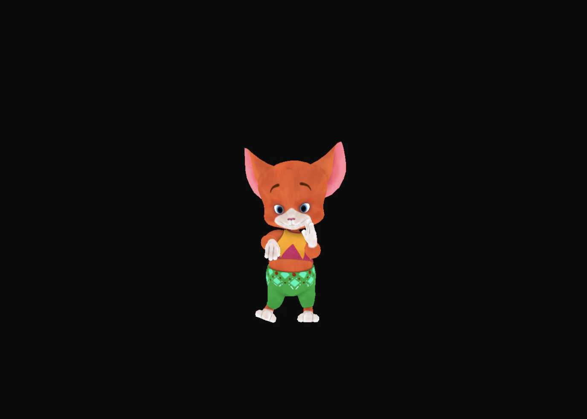

## Assignment 4 – Animated Mixamo Character

### Overview
This assignment extends the LearnOpenGL animation tutorial to showcase a fully rigged Mixamo character rendered with skeletal animation. The project demonstrates how to:

- Load and render skinned meshes (`Model`) with Assimp.
- Drive bone transforms using `Animation` and `Animator`.
- Switch between multiple animation clips at runtime (Idle and Snake Hip Hop Dance).
- Navigate the scene with a free-look camera (WASD + mouse).

### Controls
- `W / A / S / D` – Move the camera.
- Mouse move – Look around.
- Scroll wheel – Zoom (change FOV).
- `Esc` – Quit.
- `1` – Play Idle animation.
- `2` – Play Snake Hip Hop Dance animation.

### Build & Run
From the repository root:

```bash
./build.sh
cd build/Assignment_4
./Assignment_4
```

> **Tip:** If you configure manually, ensure CMake is run with `-DFETCHCONTENT_FULLY_DISCONNECTED=ON` when building in an offline sandbox.

### Assets
- Character mesh: `resources/objects/mixamo/Ch34_nonPBR.dae`
- Idle animation: `resources/objects/mixamo/Idle.dae`
- Snake Hip Hop Dance animation: `resources/objects/mixamo/Snake Hip Hop Dance.dae`
- Result media: `result/RatAnimation.png`, `result/RatAnimation.mp4`

### Implementation Notes
- `main.cpp` wires together GLFW, GLAD, the common utilities, and the LearnOpenGL animation subsystem.
- `Animator` is initialized with the idle clip and can be switched on key press.
- Bone matrices are uploaded each frame via `finalBonesMatrices`.
- Shaders (`anim_model.vs`, `anim_model.fs`) implement the skinned vertex pipeline.
- Resources are copied to the build directory via `CMakeLists.txt`.

### Screenshot / Video Preview


<p align="center">
  <a href="result/RatAnimation.mp4" download>
    
  </a>
  <a href="result/RatAnimation.mp4" target="_blank">
    
  </a>
</p>

<video src="result/RatAnimation.mp4" controls width="100%">
  Rumba dance demo
</video>

Enjoy exploring the animated workflow!
