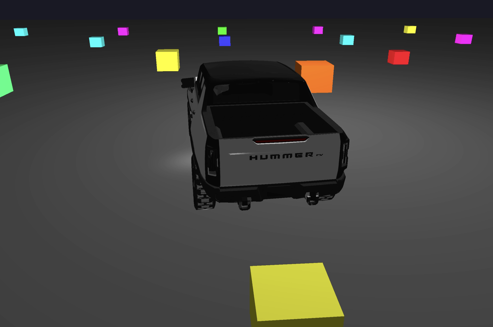

# 3D Game Development

A collection of 3D graphics projects and assignments built with OpenGL and C++.

## Quick Links

- 📖 [Assignment 2: Earth 3D Model](Assignment_2:3D_kinetic_sculpture_animation/README.md)
- 📖 [Assignment 3: Simple 3D Game](Assignment_3/README.md)
- 📖 [Final Project](Final_Project/README.md)

## Projects

### 📁 Assignment 2: Earth 3D Model
A 3D Earth model viewer with photorealistic textures and interactive controls.

**Features:**
- 🌍 Photorealistic Earth with 2K textures
- 🎮 Interactive camera controls (WASD + Mouse)
- ✨ Realistic lighting and smooth rotation

**Quick Start:**
```bash
./build.sh
cd build/Assignment_2:3D_kinetic_sculpture_animation
./Assignment_2_3D_kinetic_sculpture_animation
```

📖 [Detailed Documentation](Assignment_2:3D_kinetic_sculpture_animation/README.md)

---

### 📁 Assignment 3: Simple 3D Game
A simple 3D game with player control, camera following, and collision detection.

**Features:**
- 🎮 Player movement controls (WASD)
- 📷 Camera that follows the player
- 💥 AABB collision detection
- 🎨 3D model loading from OBJ files

**Demo:**


<video src="Assignment_3/resources/Car.mp4" controls width="100%">
  [Watch Demo Video](Assignment_3/resources/Car.mp4)
</video>

**Quick Start:**
```bash
./build.sh
cd build/Assignment_3
./Assignment_3
```

📖 [Detailed Documentation](Assignment_3/README.md)

---
