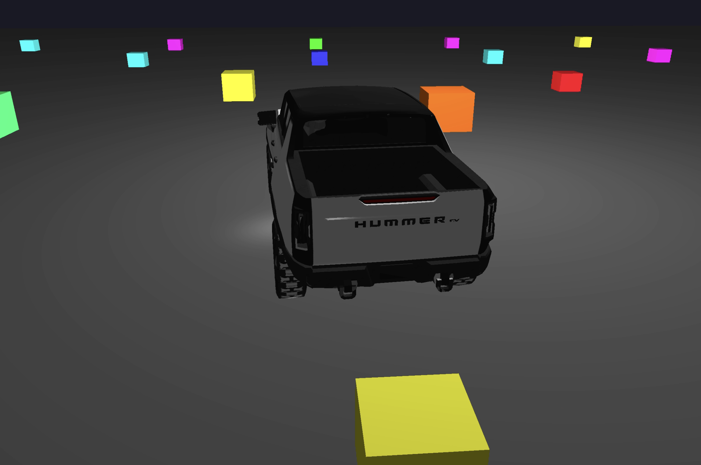
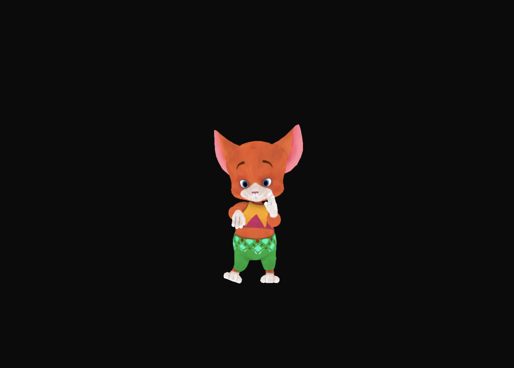

# 3D Game Development

A collection of 3D graphics projects and assignments built with OpenGL and C++.

## Quick Links
-
- 📖 [Assignment 3: Simple 3D Game](Assignment_3/README.md)
- 📖 [Assignment 4: Animated Mixamo Character](Assignment_4/README.md)

## Projects
### 📁 Assignment 2: 3D-Kinetic


Credit to Jinsters for 3d Cartoon crocodile (Croco-Roco) model [https://jinsters.booth.pm/items/1720664](https://sketchfab.com/3d-models/cartoon-crocodile-croco-roco-235cd273783e496c932820b09023211a)

Example video of the work  https://youtu.be/dAK_Rw-V7O8

Click left mouse to create new Croco-Roco with random direction rotation with the same speed rotation

### 📁 Assignment 3: Simple 3D Game
A simple 3D game with player control, camera following, and collision detection.

**Features:**
- 🎮 Player movement controls (WASD)
- 📷 Camera that follows the player
- 💥 AABB collision detection
- 🎨 3D model loading from OBJ files

**Demo:**


<p align="center">
  <a href="Assignment_3/resources/Car.mp4" download>
    
  </a>
  <a href="Assignment_3/resources/Car.mp4" target="_blank">
    
  </a>
</p>

<video src="Assignment_3/resources/Car.mp4" controls width="100%">
  [Watch Demo Video](Assignment_3/resources/Car.mp4)
</video>

**Quick Start:**
```bash
./build.sh
cd build/Assignment_3
./Assignment_3
```

📖 [Detailed Documentation](Assignment_3/README.md)

---

### 📁 Assignment 4: Animated Mixamo Character
Skeletal animation demo featuring a Mixamo character with multiple animation clips and dynamic camera controls.

**Features:**
- 🕺 Character rigged with Mixamo bones and skinned mesh
- 🔄 Smooth transitions between Idle and Snake Hip Hop Dance animations
- 🎥 Free-look camera with WASD + mouse controls
- ⌨️ Hotkeys for selecting animation clips (1 = Idle, 2 = Snake Hip Hop Dance)

**Demo:**


<p align="center">
  <a href="Assignment_4/result/RatAnimation.mp4" download>
    
  </a>
  <a href="Assignment_4/result/RatAnimation.mp4" target="_blank">
    
  </a>
</p>

<video src="Assignment_4/result/RatAnimation.mp4" controls width="100%">
  [Watch Animation Demo](Assignment_4/result/RatAnimation.mp4)
</video>

**Quick Start:**
```bash
./build.sh
cd build/Assignment_4
./Assignment_4
```

📖 [Detailed Documentation](Assignment_4/README.md)

---
